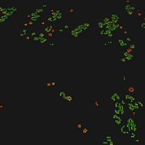

# Conway's Game of Life with GPU Acceleration


A 3D visualization of Conway's Game of Life using:
- PyTorch for GPU-accelerated game logic
- VisPy for 3D visualization
- PyQt5 for the settings UI

## Features

- GPU acceleration using PyTorch (CUDA)
- 3D visualization with cell age-based coloring
- Configurable grid size, density, and update speed
- Age-based mutation system for emergent behavior
- Stability detection to pause when patterns stabilize

## Project Structure

The project is organized into several modules, following the Separation of Concerns principle:

- `model.py` - Game logic class (GameOfLife)
- `view.py` - 3D visualization code using VisPy
- `settings.py` - Settings dialog using PyQt5
- `constants.py` - Shared constants and configuration values
- `main.py` - Program entry point and command-line argument handling
- `run.bat` - Windows batch script to run the simulation

## Setup

### Requirements

- Python 3.7 or newer
- PyTorch (with CUDA support recommended)
- VisPy
- PyQt5
- NumPy

### Installation

1. Clone this repository
2. Install dependencies:
```
pip install torch torchvision vispy pyqt5 numpy
```

## Usage

### Run the simulation

On Windows, simply run:
```
run.bat
```

Or directly using Python:
```
python main.py
```

### Command-line options

```
python main.py --help
```

Available options:
- `--size SIZE` - Grid size (default: 250)
- `--interval INTERVAL` - Update interval in milliseconds (default: 30)
- `--density DENSITY` - Initial density of live cells (default: 0.5)
- `--frame_skip FRAME_SKIP` - Number of game updates per frame (default: 1)
- `--device {cuda,cpu}` - Computation device (default: cuda if available)
- `--mutation_rate MUTATION_RATE` - Base mutation rate (default: 0.002)
- `--no_gui` - Run with command-line arguments, skip settings dialog

### Example

Run a large 500x500 grid on CPU:
```
python main.py --size 500 --device cpu
```

## Controls

- **Space** - Start/pause the simulation
- **Mouse drag** - Rotate the view
- **Mouse wheel** - Zoom in/out

## Implementation Details

### Game Logic

The simulation uses a dense representation:

1. **Dense Representation (GameOfLife)**: 
   - Uses PyTorch tensors for the entire grid
   - Faster for medium-sized grids, especially with GPU acceleration
   - Uses convolution operations for neighbor counting

### Mutations

The simulation includes an age-based mutation system:
- Cells have a chance to mutate based on their age
- Mutation probability increases logarithmically with age
- Mutations can affect the cell itself or one of its neighbors
- Creates emergent complex behaviors and prevents stagnation

## Credits

Inspired by Conway's Game of Life and extended with additional features.

## License

This project is open source and available under the MIT License. 